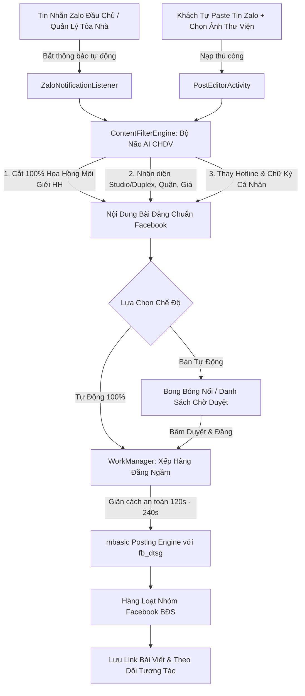

# 📋 TỔNG HỢP TOÀN DIỆN VỀ CÔNG CỤ: CHDV FACEBOOK MANAGER PRO
## HỆ THỐNG QUẢN LÝ VÀ ĐĂNG BÀI BẤT ĐỘNG SẢN / CĂN HỘ DỊCH VỤ (ZALO ➔ FACEBOOK)

> **Lĩnh vực ứng dụng chuyên biệt:** Cho Thuê Căn Hộ Dịch Vụ (CHDV), Chung Cư Mini (CCMN), Phòng Trọ & Bất Động Sản Cho Thuê tại TP.HCM, Hà Nội và các đô thị lớn.  
> **Nền tảng:** Ứng dụng Android độc lập (file APK), hoạt động trực tiếp trên điện thoại của môi giới/chủ nhà mà không cần máy tính rườm rà.

---

## 📑 MỤC LỤC
1. [Tổng Quan Kiến Trúc & Luồng Hoạt Động Khép Kín](#1-tổng-quan-kiến-trúc--luồng-hoạt-động-khép-kín)
2. [Quản Lý Tài Khoản Facebook & 1-Click Tự Động Quét Nhóm](#2-quản-lý-tài-khoản-facebook--1-click-tự-động-quét-nhóm)
3. [Bộ Não AI Form Mẫu Bán Phòng & Lọc Sạch Hoa Hồng Môi Giới](#3-bộ-não-ai-form-mẫu-bán-phòng--lọc-sạch-hoa-hồng-môi-giới)
4. [Quản Lý Kho Bài Đăng, Album Ảnh HD & Nạp Tin Đa Dạng](#4-quản-lý-kho-bài-đăng-album-ảnh-hd--nạp-tin-đa-dạng)
5. [Cơ Chế Đăng Bài Facebook Thật & Chống Checkpoint (Anti-Ban)](#5-cơ-chế-đăng-bài-facebook-thật--chống-checkpoint-anti-ban)
6. [Hai Chế Độ Vận Hành: Bán Tự Động & Tự Động 100%](#6-hai-chế-độ-vận-hành-bán-tự-động--tự-động-100)
7. [Bảng So Sánh Trước & Sau Bản Cập Nhật](#7-bảng-so-sánh-trước--sau-bản-cập-nhật)
8. [Hướng Dẫn Cài Đặt, Cấp Quyền & Vận Hành](#8-hướng-dẫn-cài-đặt-cấp-quyền--vận-hành)

---

## 1. Tổng Quan Kiến Trúc & Luồng Hoạt Động Khép Kín

Hệ thống được thiết kế như một **Trợ lý Môi Giới BĐS Số Hóa 24/7**, giải quyết triệt để khâu tốn thời gian nhất của người làm nghề cho thuê: **Cào tin từ các nhóm Zalo đầu chủ ➔ Xóa số điện thoại chủ nhà & xóa hoa hồng môi giới ➔ Viết lại bài theo văn phong thu hút ➔ Đăng phủ lên hàng chục nhóm Facebook**.



---

## 2. Quản Lý Tài Khoản Facebook & 1-Click Tự Động Quét Nhóm

Khắc phục hoàn toàn nhược điểm phải nhập tay ID nhóm, phiên bản cập nhật mang đến trải nghiệm tự động hóa ngang tầm Web Tool:

### A. Quản Lý Phiên Làm Việc (Facebook Session Manager)
- **Đăng nhập an toàn qua WebView Mobile:** Người dùng đăng nhập tài khoản Facebook chính thức trực tiếp trên điện thoại. Cookie xác thực (`c_user`, `xs`) được lưu trữ bảo mật cục bộ trong bộ nhớ máy (Private SharedPreferences), không gửi ra máy chủ trung gian.
- **Thẻ hiển thị trạng thái tài khoản:**
  - Tên Facebook & Ảnh đại diện.
  - Mã định danh tài khoản: `UID (c_user)`.
  - Trạng thái kiểm tra trực quan: `🟢 Live (Đang hoạt động)` hoặc cảnh báo nếu phiên đăng nhập hết hạn.
  - Nút **Đổi nick / Đăng nhập lại** nhanh chóng.

### B. 1-Click Tự Động Quét Sạch Toàn Bộ Nhóm FB Đã Tham Gia (`FacebookGroupScanner`)
- Người dùng **chỉ cần bấm nút duy nhất: `[🔄 Tự Động Quét Sạch Nhóm Đã Tham Gia]`**.
- Cơ chế quét:
  1. Gửi request xác thực ngầm đến `https://mbasic.facebook.com/groups/?seemore` và `https://m.facebook.com/groups/joins/`.
  2. Bộ Regex HTML Parser thông minh bóc tách toàn bộ mã ID và tên của tất cả các nhóm mà tài khoản đã tham gia.
  3. Loại bỏ các liên kết rác hệ thống (*Tạo nhóm, Khám phá, Cài đặt...*).
  4. **Tự động gán Tag Quận/Khu vực:** Quét tên nhóm và tự động gắn chip địa lý tương ứng (*Bình Thạnh, Quận 3, Quận 1, Phú Nhuận, Quận 10, TP. Thủ Đức, Khu Vực Đại Học...*).
  5. Tự động lưu trữ danh sách vào cơ sở dữ liệu để tái sử dụng lâu dài.

### C. Bộ Công Cụ Thao Tác Nhóm Hàng Loạt
- **Thanh tìm kiếm tức thì:** Gõ từ khóa tên nhóm hoặc tên Quận để lọc nhanh nhóm cần đăng.
- **Nút "Chọn tất cả" & "Bỏ chọn":** Bật/tắt hàng loạt 50–100 nhóm chỉ bằng 1 chạm.
- **Bộ đếm thời gian thực:** Hiển thị rõ ràng: *"Đã chọn: X / Y nhóm"*.
- **Nút icon Facebook trên từng nhóm:** Bấm vào là mở trực tiếp trang nhóm trên ứng dụng Facebook để kiểm tra quy định nhóm, bài ghim hoặc xem lại bài viết của mình.

---

## 3. Bộ Não AI Form Mẫu Bán Phòng & Lọc Sạch Hoa Hồng Môi Giới

> ⚠️ **Nỗi đau lớn nhất của môi giới BĐS:** Trong các nhóm chat Zalo đầu chủ, tin nhắn thường kèm theo thông tin nội bộ rất nhạy cảm: `HH 50%`, `hh 1 tháng`, `phí mg 3tr`, `lh chủ nhà A.Tuấn 0901...`. Nếu đăng nhầm lên Facebook có khách hàng xem sẽ bị "lộ bài", mất khách và lộ số chủ nhà!

### A. Thuật Toán Lọc 100% Hoa Hồng Môi Giới (`BROKER_COMMISSION_REGEX`)
Bộ lọc thông minh nhận diện và xóa triệt để:
- Các biến thể phần trăm: `HH 50%`, `hh 60%`, `hoa hồng 50%`, `hh ctv 50%`...
- Các biến thể tháng thuê: `hh 1 tháng`, `HH 0.5 tháng`, `phí môi giới 1th`...
- Các biến thể tiền mặt: `hh 3tr`, `hoa hồng 2.5 triệu`, `phí mg 3.500k`...
- Xóa sạch các đường link mời vào nhóm Zalo cũ (`zalo.me/...`).

### B. Tự Động Bóc Tách Dữ Liệu Căn Hộ
- **Nhận diện loại phòng (`extractRoomType`):** Tự động phân loại từ khóa trong tin nhắn:
  - Có `gác`, `lửng`, `duplex` ➔ Gán nhãn **Duplex Gác Lửng**.
  - Có `studio`, `stu`, `ban công` ➔ Gán nhãn **Studio Ban Công**.
  - Có `1pn`, `1 phòng ngủ` ➔ Gán nhãn **1 Phòng Ngủ Riêng**.
  - Có `2pn`, `2 phòng ngủ` ➔ Gán nhãn **2 Phòng Ngủ Cao Cấp**.
  - Có `ccmn`, `chung cư mini` ➔ Gán nhãn **Chung Cư Mini**.
- **Nhận diện Quận/Khu vực (`extractDistrict`):** Tự động phân tích các địa danh: Quận 1, Quận 3, Bình Thạnh (D2, Hutech), Phú Nhuận, Quận 10, Tân Bình, Gò Vấp, Quận 7, TP. Thủ Đức...
- **Nhận diện giá thuê (`extractPrice`):** Trích xuất các cụm số kèm đơn vị: `6.5tr` ➔ `6.5 Triệu / tháng`, `7tr5` ➔ `7.5 Triệu / tháng`.

### C. Ráp Vào Form Mẫu Chuẩn Facebook (Customizable AI Template)
Người dùng có thể tùy chỉnh khung form bán phòng trong Tab Cài đặt:

```text
🔥 [TIÊU ĐỀ GIẬT TÍT & LOẠI PHÒNG] 🔥

📍 Vị trí: [Đường, Quận - Thuận tiện di chuyển]
💰 Giá thuê: [Giá thuê / tháng]

✨ TIỆN NGHI CĂN HỘ (Full nội thất cao cấp):
- Máy lạnh, tủ lạnh, máy giặt, giường nệm cao cấp.
- Tủ quần áo lớn, bàn làm việc, kệ bếp riêng nấu ăn.

🏢 TIỆN ÍCH TÒA NHÀ:
- Khóa cổng vân tay, camera an ninh 24/7.
- Giờ giấc tự do 100%, không chung chủ.
- Thang máy, bãi để xe rộng rãi, cho nuôi pet 🐶🐱.

📝 Chi tiết thêm từ chủ nhà:
[CÁC_DÒNG_MÔ_TẢ_THÔ_ĐÃ_LỌC_SẠCH_HOA_HỒNG]

☎️ LIÊN HỆ XEM PHÒNG TRỰC TIẾP:
[HOTLINE_VA_CHUKY_CỦA_BẠN]

#chothuecanho #canhodichvu #chdv #phongtro #chothue
```

---

## 4. Quản Lý Kho Bài Đăng, Album Ảnh HD & Nạp Tin Đa Dạng

### A. Ba Phương Thức Nạp Tin Cực Kỳ Linh Hoạt
1. **Tự động bắt thông báo Zalo:** Khi điện thoại nhận tin nhắn từ các nhóm Zalo đầu chủ, app tự động bóc tách và đưa vào giỏ hàng.
2. **Nạp tin thủ công (Copy & Paste):** Người dùng chỉ cần copy bài viết trên Zalo PC/điện thoại, mở app bấm **"📋 Dán tin"** và bấm **"🤖 AI Viết Lại"** để chuẩn hóa chỉ trong 1 giây.
3. **Chọn nhiều ảnh sắc nét từ Thư viện máy (Gallery Picker):** Bấm nút **"+ Thêm ảnh HD"** cho phép chọn cùng lúc 3–10 ảnh căn hộ góc rộng, chất lượng cao từ album điện thoại (hỗ trợ `ActivityResultContracts.GetMultipleContents`).

### B. Màn Hình Quản Lý & Bộ Lọc Phân Trạng Thái (Status Filters)
Màn hình Giỏ Hàng Phòng được trang bị thanh Filter Chips:
- **Tất cả bài:** Hiển thị toàn bộ kho hàng phòng.
- **Chờ duyệt (Pending):** Các bài mới lấy từ Zalo hoặc mới soạn, chờ người dùng kiểm tra.
- **Đã đăng (Posted):** Các bài đã được đăng thành công lên Facebook. Hiển thị nút **"🔗 Mở bài trên Facebook"** để mở trực tiếp kiểm tra khách hỏi thuê.
- **Lỗi (Failed):** Các bài đăng gặp sự cố (nhóm bắt admin duyệt, checkpoint...). Có thông báo chi tiết lý do và nút **"⚠️ Thử lại (Retry)"**.

---

## 5. Cơ Chế Đăng Bài Facebook Thật & Chống Checkpoint (Anti-Ban)

### A. Posting Engine Mô Phỏng `mbasic` Đi Kèm Bảo Mật `fb_dtsg`
- Không sử dụng Graph API lỗi thời (vì Facebook chặn Graph API nếu không có Token doanh nghiệp).
- Ứng dụng thực hiện cơ chế tự động hóa:
  1. Truy cập vào trang nhóm mục tiêu `https://mbasic.facebook.com/groups/$groupId`.
  2. Tự động bóc tách mã xác thực phiên: `fb_dtsg`, `jazoest` và URL xử lý form composer.
  3. Đóng gói dữ liệu bài viết (Nội dung chữ + Multipart ảnh) gửi lên Facebook.
  4. Kiểm tra phản hồi HTTP và nội dung trang để xác nhận: Đăng thành công hay rơi vào hàng đợi duyệt của Admin.

### B. Giãn Cách Ngẫu Nhiên Chống Checkpoint (Anti-Ban Jitter)
- Khi đăng bài lên nhiều nhóm, Facebook sẽ khóa tài khoản nếu phát hiện bắn bài dồn dập trong vài giây.
- Ứng dụng tích hợp thuật toán **Giãn cách an toàn (Anti-Ban Jitter)**:
  - Thiết lập thời gian cơ sở: `180 giây` (có thể chỉnh trong Cài đặt từ 120s – 300s).
  - Thuật toán tự động cộng/trừ ngẫu nhiên một khoảng `±15s đến 30s` giữa các nhóm.
  - Hành vi đăng bài hoàn toàn tự nhiên như một con người đang thao tác trên điện thoại.

### C. Chế Độ Chia Sẻ 1-Chạm Sang App Facebook Chính Thức (Native Share Fallback)
Nếu người dùng không muốn dùng Cookie hoặc muốn đăng bài có tag bạn bè/vị trí:
- Bấm nút chia sẻ ➔ Ứng dụng tự động sao chép toàn bộ caption AI vào bộ nhớ tạm (Clipboard), gom toàn bộ ảnh căn hộ và mở thẳng ứng dụng Facebook chính thức. Người dùng chỉ cần dán caption và bấm Đăng.

---

## 6. Hai Chế Độ Vận Hành: Bán Tự Động & Tự Động 100%

Hệ thống cho phép bật/tắt linh hoạt ngay tại đầu màn hình chính:

| Chế độ | Cách thức hoạt động | Phù hợp khi nào? |
| :--- | :--- | :--- |
| **Bán Tự Động (Khuyên Dùng)** | - Zalo có tin ➔ AI tự động bóc tách, chuẩn hóa form mẫu sẵn.<br>- Hiện **Bong bóng nổi (Floating Bubble)** hoặc nằm trong danh sách Chờ Duyệt.<br>- Bạn liếc mắt kiểm tra giá, ảnh và bấm **[🚀 Duyệt & Đăng]** thì tool mới đăng. | Môi giới muốn kiểm soát 100% hình ảnh và giá cả trước khi tiếp cận khách hàng. |
| **Tự Động 100% (Full Auto)** | - Zalo có tin phòng ➔ AI tự động lọc hoa hồng, thay Hotline, ráp form.<br>- Tự động đưa vào hàng đợi `WorkManager` đăng ngầm tuần tự lên tất cả các nhóm FB đã chọn theo thời gian giãn cách. | Phù hợp khi bạn đang đi ngoài đường, dẫn khách hoặc đang ngủ mà vẫn muốn bài đăng phủ sóng liên tục. |

---

## 7. Bảng So Sánh Trước & Sau Bản Cập Nhật

| Hạng mục | Bản Cũ (Trước Cập Nhật) | Bản Mới (CHDV Facebook Manager Pro) |
| :--- | :--- | :--- |
| **Quản lý Nhóm FB** | Phải gõ ID thủ công từng nhóm hoặc dùng 2 nhóm mẫu. | **1-Click Tự Động Quét Sạch toàn bộ nhóm** đã tham gia từ Cookie. |
| **Thao tác Nhóm** | Không có tìm kiếm, không có chọn tất cả. | Có ô tìm kiếm nhóm/Quận, nút **Chọn tất cả**, **Bỏ chọn**, đếm số nhóm. |
| **Link nhóm Facebook** | Không xem được nhóm. | Tích hợp nút **mở trực tiếp nhóm trên Facebook** để kiểm tra. |
| **Nguồn ảnh căn hộ** | Chỉ lấy 1 ảnh thumbnail nhỏ mờ từ Zalo notification. | Có nút **+ Thêm ảnh HD từ Thư viện**, chọn cùng lúc 3–10 ảnh rõ nét. |
| **Nội dung tin nhắn** | Mẫu e-commerce quần áo bán hàng sỉ lẻ. | **Chuyên biệt 100% cho CHDV**: Studio, Duplex, Quận, Giá thuê. |
| **Xử lý Hoa hồng** | Chưa lọc hoa hồng nội bộ. | **Lọc triệt để 100% `HH 50%`, `hh 1 tháng`**, không lộ bí mật sale. |
| **Cơ chế Đăng bài** | Gọi Graph API lỗi thời (bị Facebook chặn Cookie). | **Mô phỏng `mbasic` kèm `fb_dtsg`**, đăng ngầm ổn định. |
| **Bộ lọc bài viết** | Danh sách chung, không phân loại. | Thanh Filter Chips: **Tất cả / Chờ duyệt / Đã đăng / Lỗi**. |
| **Nhật ký kết quả** | Không biết bài đã đăng ở đâu. | Lưu link bài viết thực tế (`fbPostUrl`), bấm vào mở xem ngay. |

---

## 8. Hướng Dẫn Cài Đặt, Cấp Quyền & Vận Hành

### Bước 1: Tải và Cài Đặt File APK
1. Truy cập trực tiếp link GitHub Actions của bản build thành công: [**Bản Build APK #35197914784**](https://github.com/hoangbao-code/tool-fb-automation/actions/runs/35197914784).
2. Tải tệp **`Z2FB-Post-Manager-Debug-APK.zip`** ở mục **Artifacts** cuối trang.
3. Giải nén file `.zip` trên điện thoại để nhận file **`app-debug.apk`**.
4. Mở file để cài đặt (nếu Google Play Protect cảnh báo do app dạng debug cá nhân chưa đưa lên CH Play Store, hãy chọn **"Vẫn cài đặt / Install anyway"**).

### Bước 2: Cấp Quyền Hoạt Động (Chỉ Làm 1 Lần Duy Nhất)
Vào Tab **Cài Đặt & AI Form**:
- Bấm **"Cấp quyền Bắt thông báo Zalo"** ➔ Bật công tắc cho ứng dụng *CHDV Post Manager*.
- Bấm **"Cấp quyền Bong bóng nổi"** ➔ Cho phép ứng dụng hiển thị trên các ứng dụng khác.

### Bước 3: Đăng Nhập & Quét Nhóm Facebook
1. Chuyển sang Tab **Nhóm Facebook BĐS**.
2. Bấm **"Đăng nhập"** ➔ Đăng nhập tài khoản Facebook của bạn trong màn hình WebView an toàn.
3. Sau khi đăng nhập thành công, bấm nút: **`[🔄 Tự Động Quét Sạch Nhóm Đã Tham Gia]`**.
4. Toàn bộ danh sách nhóm BĐS bạn đã tham gia sẽ hiện ra kèm Tag Quận. Bấm **"Chọn tất cả"** hoặc tích chọn các nhóm bạn muốn phủ sóng.

### Bước 4: Cấu Hình Hotline & AI Form
1. Chuyển sang Tab **Cài Đặt & AI Form**.
2. Điền số Hotline/Zalo cá nhân của bạn vào ô: `Hotline & Zalo của bạn (Môi giới)`.
3. Điền chữ ký mong muốn vào ô: `Chữ ký kết bài`.
4. Bấm **"Lưu Cấu Hình"**.

### Bước 5: Bắt Đầu Đăng Bài BĐS
- **Khi có khách gửi tin Zalo:** Bạn chỉ cần mở app, bài viết đã được AI bóc tách sẵn loại phòng, giá, quận và lọc sạch hoa hồng.
- **Hoặc nạp tin thủ công:** Bấm nút **"+ Thêm phòng"**, dán nội dung từ Zalo, chọn ảnh căn hộ HD từ máy, bấm **"🤖 AI Viết Lại"** rồi bấm **"🚀 Đăng bài ngay"**!
